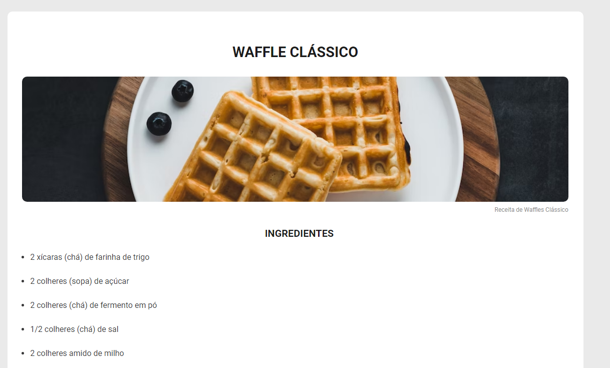
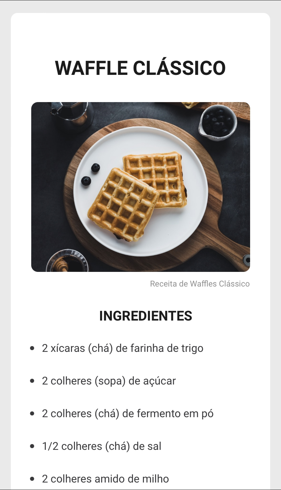

# WAFFLE RECIPE 🧇

## DESCRIPTION 📃
In this project, a web page of a waffle recipe was developed with title,
image, list of ingredients and method of preparation.

## TECHNOLOGIES 👩‍💻
* HTML
* CSS

## LIBRARY 📚
* [GOOGLE FONTS](https://fonts.google.com/)

## PROJECT IN DESKTOP 🖥️

## PROJECT IN MOBILE 📱

## CREDITS
* DEVELOPER: [ARTHUR OLIVEIRA](https://github.com/Th-uro)
* COURSE: [DISCOVER - ROCKETSEAT](https://www.rocketseat.com.br/)